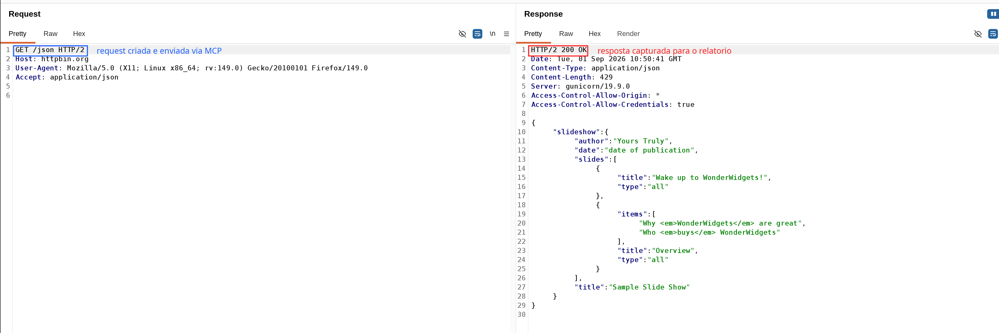

# Burp Suite MCP Server Extension

## Overview

Integrate Burp Suite with AI Clients using the Model Context Protocol (MCP).

For more information about the protocol visit: [modelcontextprotocol.io](https://modelcontextprotocol.io/)

## Features

- Connect Burp Suite to AI clients through MCP
- Automatic installation for Claude Desktop
- Comes with packaged Stdio MCP proxy server
- Capture the Burp UI or full desktop as PNG evidence
- Crop screenshots to the relevant Repeater, Intruder, Proxy, or Scanner area
- Add report-ready rectangles, highlights, arrows, callout text, blur, and redaction
- Return the resulting PNG directly to image-capable MCP clients

## Evidence capture fork

This working branch extends the upstream PortSwigger MCP server with three tools:

- `capture_burp_evidence`: captures Burp or the full desktop and optionally crops it;
- `list_repeater_tabs`: lists the visible Repeater tabs with stable 1-based indexes;
- `delete_repeater_tab`: closes one exact Repeater tab by name or 1-based index;
- `annotate_burp_evidence`: adds `rectangle`, `highlight`, `arrow`, `callout`,
  `text`, `blur`, or `redact` annotations;
- `list_burp_evidence`: lists recent PNG evidence files.

Configure the feature in Burp under `MCP` -> `Evidence capture`. The panel lets
you enable the tools, choose the evidence directory, default PoC folder and
default scope, and choose whether the PNG is returned to the MCP client. Each
capture is saved below `<evidence-directory>/<poc-folder>/` and listings recurse
through PoC folders. All file operations are restricted to the configured
evidence directory.

Example annotation matching a pentest report screenshot:

```json
{
  "capturePath": "C:/Users/Will/.burp-mcp/evidence/repeater.png",
  "annotations": [
    {
      "type": "rectangle",
      "x": 615,
      "y": 385,
      "width": 585,
      "height": 220,
      "color": "#ff2020",
      "strokeWidth": 4
    },
    {
      "type": "callout",
      "x": 385,
      "y": 570,
      "width": 165,
      "endX": 585,
      "endY": 545,
      "text": "Teste de escrita",
      "color": "#ff2020",
      "fontSize": 28
    }
  ]
}
```

### Example: capturing a Repeater request end to end

The screenshot below was produced entirely through MCP tool calls against a live
Burp instance - no manual clicking:



**1. `create_repeater_tab`** - create the tab with a raw request:

```json
{
  "tabName": "demo-evidence",
  "targetHostname": "httpbin.org",
  "targetPort": 443,
  "usesHttps": true,
  "content": "GET /json HTTP/1.1\r\nHost: httpbin.org\r\nAccept: application/json\r\nConnection: close\r\n\r\n"
}
```

**2. `send_repeater_tab`** - select that tab and click its Send button, waiting for
the response to populate:

```json
{ "tabName": "demo-evidence", "waitMs": 6000 }
```

**3. `scroll_repeater_response`** - scroll the response viewer so the body is
visible instead of only headers (`0.0` = top, `1.0` = bottom):

```json
{ "fraction": 0.0, "requestSide": false }
```

**4. `capture_burp_evidence`** - capture and crop to the request/response panes:

```json
{
  "label": "readme-demo",
  "poc": "readme",
  "cropX": 0,
  "cropY": 160,
  "cropWidth": 1860,
  "cropHeight": 620
}
```

**5. `annotate_burp_evidence`** - box the request line and the status line, and
label both:

```json
{
  "capturePath": "<path returned by step 4>",
  "annotations": [
    { "type": "rectangle", "x": 50, "y": 170, "width": 275, "height": 38,
      "color": "#2060ff", "strokeWidth": 4 },
    { "type": "text", "x": 360, "y": 200, "text": "request sent via MCP",
      "color": "#2060ff", "fontSize": 30 },
    { "type": "rectangle", "x": 1968, "y": 170, "width": 220, "height": 38,
      "color": "#ff2020", "strokeWidth": 4 },
    { "type": "text", "x": 2225, "y": 200, "text": "response captured for the report",
      "color": "#ff2020", "fontSize": 30 }
  ]
}
```

Each step returns the saved PNG path, and the annotated file is written alongside
the original with an `-annotated` suffix, so the unannotated capture is preserved.

#### Coordinate systems

The two coordinate spaces are not the same, which matters on HiDPI displays:

- **Crop** coordinates (`cropX`/`cropY`/`cropWidth`/`cropHeight`) are in **logical
  UI pixels**, the same units as the Burp window size.
- **Annotation** coordinates are in **physical pixels of the captured PNG**.

On a 2x display a capture of a 1860x620 logical crop is returned as a 3720x1240
PNG, so annotation coordinates are roughly double the crop values. On a 1x display
the two spaces coincide. Read `width`/`height` from the capture result and place
annotations against those numbers rather than against the crop you asked for.


## Usage

- Install the extension in Burp Suite
- Configure your Burp MCP server in the extension settings
- Configure your MCP client to use the Burp SSE MCP server or stdio proxy
- Interact with Burp through your client!

## Installation

### Prerequisites

Ensure that the following prerequisites are met before building and installing the extension:

1. **Java**: Java must be installed and available in your system's PATH. You can verify this by running `java --version` in your terminal.
2. **jar Command**: The `jar` command must be executable and available in your system's PATH. You can verify this by running `jar --version` in your terminal. This is required for building and installing the extension.

### Building the Extension

1. **Clone the Repository**: Obtain the source code for the MCP Server Extension.
   ```
   git clone https://github.com/PortSwigger/mcp-server.git
   ```

2. **Navigate to the Project Directory**: Move into the project's root directory.
   ```
   cd mcp-server
   ```

3. **Build the JAR File**: Use Gradle to build the extension.
   ```
   ./gradlew embedProxyJar
   ```

   This command compiles the source code and packages it into a JAR file located in `build/libs/burp-mcp-all.jar`.

### Loading the Extension into Burp Suite

1. **Open Burp Suite**: Launch your Burp Suite application.
2. **Access the Extensions Tab**: Navigate to the `Extensions` tab.
3. **Add the Extension**:
    - Click on `Add`.
    - Set `Extension Type` to `Java`.
    - Click `Select file ...` and choose the JAR file built in the previous step.
    - Click `Next` to load the extension.

Upon successful loading, the MCP Server Extension will be active within Burp Suite.

## Configuration

### Configuring the Extension
Configuration for the extension is done through the Burp Suite UI in the `MCP` tab.
- **Toggle the MCP Server**: The `Enabled` checkbox controls whether the MCP server is active.
- **Enable config editing**: The `Enable tools that can edit your config` checkbox allows the MCP server to expose tools which can edit Burp configuration files.
- **Advanced options**: You can configure the port and host for the MCP server. This evidence fork defaults to `http://127.0.0.1:9877` to avoid the local WSL relay already using 9876.

### Claude Desktop Client

To fully utilize the MCP Server Extension with Claude, you need to configure your Claude client settings appropriately.
The extension has an installer which will automatically configure the client settings for you.

1. Currently, Claude Desktop only support STDIO MCP Servers
   for the service it needs.
   This approach isn't ideal for desktop apps like Burp, so instead, Claude will start a proxy server that points to the
   Burp instance,  
   which hosts a web server at a known port (`localhost:9876`).

2. **Configure Claude to use the Burp MCP server**  
   You can do this in one of two ways:

    - **Option 1: Run the installer from the extension**
      This will add the Burp MCP server to the Claude Desktop config.

    - **Option 2: Manually edit the config file**  
      Open the file located at `~/Library/Application Support/Claude/claude_desktop_config.json`,
      and replace or update it with the following:
      ```json
      {
        "mcpServers": {
          "burp": {
            "command": "<path to Java executable packaged with Burp>",
            "args": [
                "-jar",
                "/path/to/mcp/proxy/jar/mcp-proxy-all.jar",
            "--sse-url",
                "<your Burp MCP server URL configured in the extension>"
            ]
          }
        }
      }
      ```

3. **Restart Claude Desktop** - assuming Burp is running with the extension loaded.

## Manual installations
If you want to install the MCP server manually you can either use the extension's SSE server directly or the packaged
Stdio proxy server.

### SSE MCP Server
To use the SSE server directly, provide the configured server URL to your MCP client:
```
http://127.0.0.1:9877
```

### Stdio MCP Proxy Server
The source code for the proxy server can be found here: [MCP Proxy Server](https://github.com/PortSwigger/mcp-proxy)

In order to support MCP Clients which only support Stdio MCP Servers, the extension comes packaged with a proxy server for
passing requests to the SSE MCP server extension.

If you want to use the Stdio proxy server you can use the extension's installer option to extract the proxy server jar.
Once you have the jar you can add the following command and args to your client configuration:
```
/path/to/packaged/burp/java -jar /path/to/proxy/jar/mcp-proxy-all.jar --sse-url http://127.0.0.1:9877
```

If you modify the proxy source, rebuild and copy it into this project before packaging the extension:
```bash
# From mcp-proxy
./gradlew shadowJar
cp build/libs/mcp-proxy-all.jar /path/to/mcp-server/libs/mcp-proxy-all.jar

# From mcp-server
./gradlew embedProxyJar
```

### Creating / modifying tools

Tools are defined in `src/main/kotlin/net/portswigger/mcp/tools/Tools.kt`. To define new tools, create a new serializable
data class with the required parameters which will come from the LLM.

The tool name is auto-derived from its parameters data class. A description is also needed for the LLM. You can return
a string or a `List<ContentBlock>` to provide data back to the LLM.

Extend the Paginated interface to add auto-pagination support.
